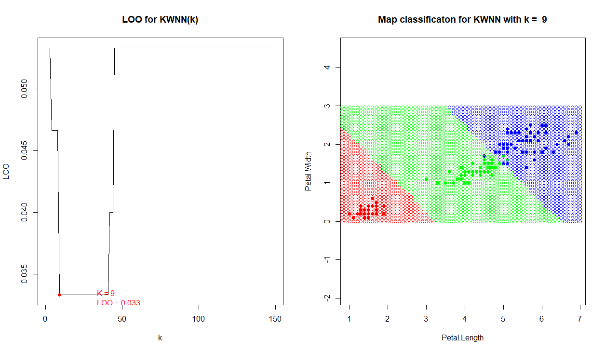
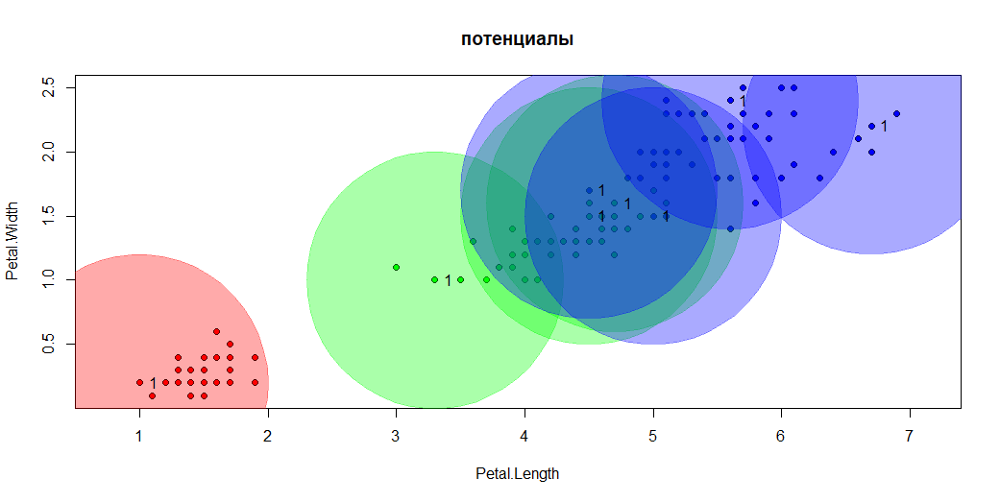

# MachineLearning

- [Метрические алгоритмы классификации](#Метрические-алгоритмы-классификации)
  - [1NN](#1NN)
  - [KNN](#KNN)
  - [KWNN](#KWNN)
  - [Сравнение качества алгоритмов kNN и kwNN](#Сравнение-качества-алгоритмо-kNN-и-kwNN)
  - [Парзеновское окно](#Парзеновское-окно)
  - [Метод Потенциальных Функций](#Метод-потенциальных-функций)
  - [Сравнение алгоритмов классификации](#Сравнение-алгоритмов-классификации)


## Метрические алгоритмы классификации
__Гипотеза компактности:__
Схожим объектам соответствуют схожие ответы.
Для формализации понятия сходства вводится __функция расстояния__ в
пространстве объектов X. 

__Метрические методы обучения__ — методы, основанные на анализе сходства
объектов. (similarity-based learning, distance-based learning).

## 1NN 
Алгоритм ближайшего соседа – 1NN относит классифицируемый объект
u ∈ X к тому классу, которому принадлежит его ближайший сосед:
<a href="http://www.picshare.ru/view/9312477/" target="_blank"></a>


__Преимуществ:__
<ul>
  <li>Простота реализации.</li>
</ul>

__Недостатки:__
<ul>
  <li>Неустойчивость к погрешностям — выбросам.</li>
  <li>Отсутствие параметров, которые можно было бы настраивать по выборке.</li>
  <li>Алгоритм полностью зависит от того, насколько удачно выбрана метрика ρ.</li>
  <li>Низкое качество классификации.</li>
</ul>

## KNN 

__Алгоритм k ближайших соседей – kNN__ относит объект u к тому классу,
элементов которого больше среди k ближайших соседей x.
__функция оценки близости__  <br><a href="https://imgbb.com/"></a>

При k = 1 получаем метод ближайшего соседа
и, соответственно, неустойчивость к шуму, при k = l, наоборот, алгоритм
чрезмерно устойчив и вырождается в константу. Таким образом, крайние значения
k нежелательны. На практике оптимальное k подбирается по критерию
скользящего контроля LOO.

 
## KWNN
Существует и альтернативный вариант метода kNN: в каждом классе выбирается
__k__ ближайших к __U__ объектов, и объект u относится к тому классу, для
которого среднее расстояние до __k__ ближайших соседей минимально.

где,
 — строго убывающая последовательность вещественных весов, задающая
вклад i-го соседа при классификации объекта u.

 
я решил использовать весы такого вида
```
weightsKWNN = function(i, k)
{
  (k + 1 - i) / k
}
```

## Сравнение качества алгоритмо kNN и kwNN. 

kNN — один из простейших алгоритмов классификации, поэтому на реальных задачах он зачастую оказывается неэффективным. Помимо точности классификации, проблемой этого классификатора является скорость классификации.

kwNN отличается от kNN, тем что учитывает порядок соседей классифицируемого объекта, улчшая качество классификации.
Пример, показывающий преимущество метода kwNN над kNN:
<a href="http://www.picshare.ru/view/9312480/" target="_blank"></a>

В примере передается параметр k=5. Так как Kwnn в отличии от Knn оценивает не только индекс соседа, но и его расстояние, то результат получается более точный, в этом примере это наглядно видно.

## Парзеновское окно
В методе Парзеновского окна, мы используем ту же Евклидову метрику, и используем весовую функцию w(i,u) как функцию не от ранга соседа, а  функцию от расстояния, однако в отличии от  KWNN, вместо k объектов, используется ширина окна, которую я нахожу с помощью метода Скользящего Контроля LOO, а функция веса реализована с помощью различных ядер.
Программная реализация :
```
Parzen = function(XL,y,h,metricFunction = euclideanDistance)
{
  n = dim(XL)[1]
  weights = rep(0,3)
  for(i in 1:n)
  {   
    x=XL[i,1:2]
    class=XL[i,3]
    r = metricFunction(x,y)/h
    weights[class]=kernelG(r)+weights[class];
  }
  
  class = names(which.max(weights))
  if(max(weights)==0){
    return ("NA")
  }
  else{
    return (class)
  }
}
```

Я программно использовал такие ядра:

Епанечниково 
```
kernelEP = function(r){
  return ((3/4*(1-r^2)*(abs(r)<=1)))
}
```
.png) 


Прямоугольное 
```
kernelR = function(r){
  return ((0.5 * (abs(r) <= 1) ))
} 
```
.png) 

Треугольное 
```
kernelT = function(r){
  return ((1 - abs(r)) * (abs(r) <= 1)) 
}
```
.png) 
Квартическое 
```
kernelQ = function(r){
  return ((15 / 16) * (1 - r ^ 2) ^ 2 * (abs(r) <= 1)) 
}
```
.png) 
Гауссовское 
```
kernelG = function(r){
  return (((2*pi)^(-1/2)) * exp(-1/2*r^2))
}
```
.png) 

__Вывод:__

Разница в качестве классификации очень слабая,  только гауссовское ядро заметно отличается. 
Т.К алгоритм для классифицируемой точки u строит окружность, радиусом h. Все точки, не попавшие в эту окружность, отсеиваются (в ядрах кроме гауссовского). Для всех остальных ядер, находится вес, для каждой точки внутри окна, суммируется, и класс с наибольшим весом, присваивается обучаемому объекту.

## Метод потенциальных функций
Метод потенциальных функций - метрический классификатор, частный случай метода ближайших соседей. Позволяет с помощью простого алгоритма оценивать вес («важность») объектов обучающей выборки при решении задачи классификации.

Для оценки близости объекта классифицируемого объекта u к классу y, алгоритм использует следующую функцию: 


Я использовал Епанечниково ядро для оценки веса. В моей реализации алгоритм подбирает только силу потенциала , радиус потенциалов h я задал заранее фиксированным.

Программная реализация подбора потенциалов пока точность алгоритма, не будет меньше заданной ошибки myError
```
potentials = function(XL,class,n,h,myError){
  error=100
  pots = rep(0,n)  
  while(error>myError)
  {    
    while(TRUE){
      z=sample(1:n,1)
      x=XL[z,1:2]
      point = PF(pots,XL,x,h)
   
      if (colors[point] != colors[class[z]]) {
        pots[z] = pots[z] + 1
        break
      } 
    }
     
      error = 0
      for (i in 1:n) {
        x = XL[i,1:2]
        points=XL[,1:3]
        if (colors[PF(pots,points,x, h)]!= colors[class[i]]){
          error = error + 1
        }
      }
      print(error)
  }
  return(pots)
}
```
Алгоритм для каждого обучающего объекта x  имеющего потенциал строит окружность, радиуса h.
 

## Сравнение-алгоритмов-классификации
<table>
<tr><td>Метод</td><td>параметры</td><td>величина ошибок</td><tr>
<tr><td> 1NN</td><td>-</td><td>0.47</td><tr>
<tr><td> KNN</td><td>k=6</td><td>0.33</td><tr>
<tr><td> KWNN</td><td>k=9</td><td>0.33</td<tr>
<tr><td> Парзеновское окно</td><td>h=0.4;h=0.1(Гауссовское)</td><td>0.4</td<tr>
 <table>


